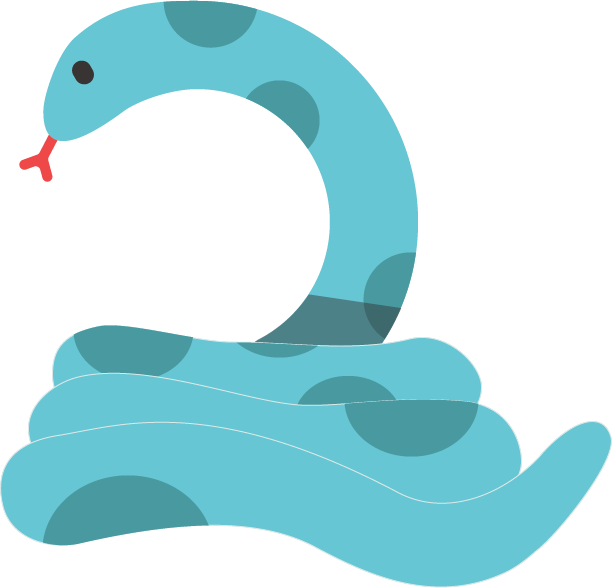

<h1 align="center">
    SNAKE GAME ASCII
</h1>

<h1 align="center">
    
</h1>


## How to compile the project
```bash
gcc ./map/map.c ./opening_end/opening.c ./opening_end/end.c snakeGame.c -o snakeGame
```

Obs.: this command only works if you are inside "windows" folder.

## How to download the project

```bash
    $ git clone https://github.com/erickoda/snake-game
```

## Only available on Windows

This project uses libs that are only available for windows. The libs are:

<ul>
    <li>
        conio.h (only available for MS-DOS compilers)
    </li>
    <li>
        Window.h (it's a lib which contains all Windows's API functions)
    </li>
</ul>

Obs. I would like to make a version compatible with Linux

# How to Play

Once you have compiled your project, you just have to execute it. You can do it by writing a command on terminal or just double click on snakeGame.exe. The command is:

    ./snakeGame.exe

Now you have it open. Choose the difficulty you want to play. Then uses de keyboards 'w' 'a' 's' 'd' to move the snake. In the video below, you can see an example of a gameplay.

</img>